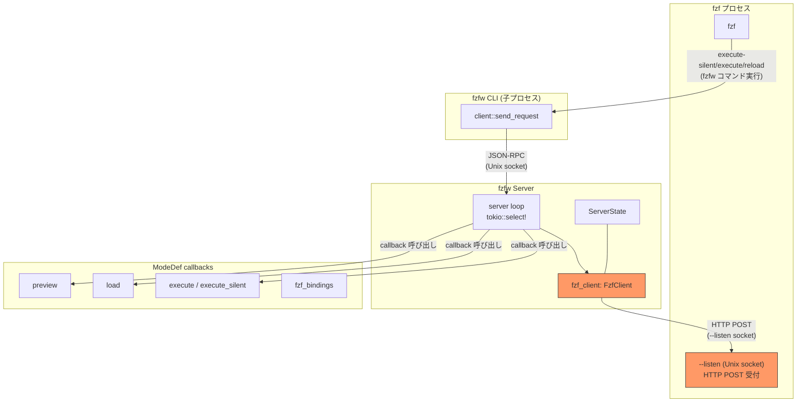
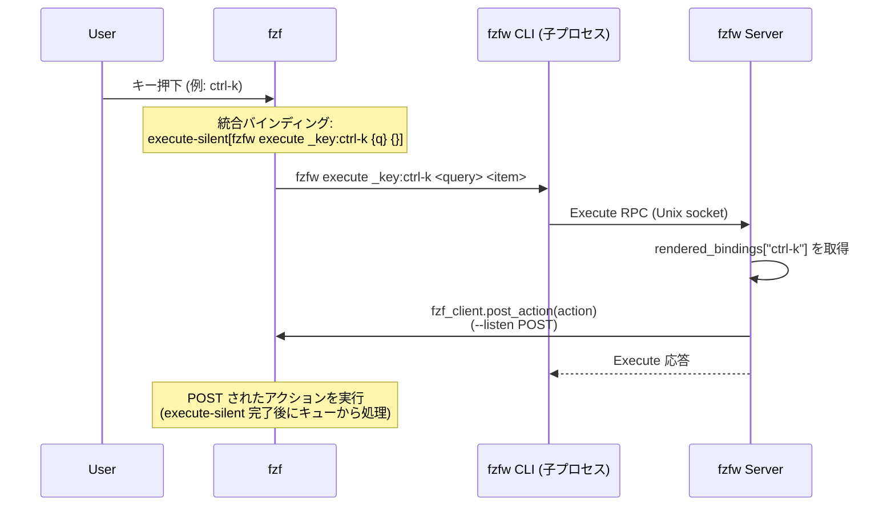

# アーキテクチャ図

## コンポーネント構成

## キーバインド処理フロー (execute-silent 方式)

全キーは統合バインディングで `execute-silent` にマッピングされ、
サーバーが現モードの `rendered_bindings` を参照して fzf に POST する。

### アクセス範囲

| コンポーネント | アクセスできるもの |
|---|---|
| Server loop | `Env`, `ServerState` (fzf_client, all_modes, current_mode_name, sort_enabled 含む) |
| ModeDef callbacks | `&Env` (config, nvim, fzf_client), `&mut State` (last_load_resp) |

### サーバーハンドラ

サーバーは 3 つの RPC のみ受け付ける:

| ハンドラ | 用途 |
|---|---|
| **Load** | fzf の候補一覧をストリーム返却 |
| **Preview** | 選択中アイテムのプレビュー |
| **Execute** | `_key:` プレフィックス → rendered_bindings を POST / それ以外 → コールバック実行 |
